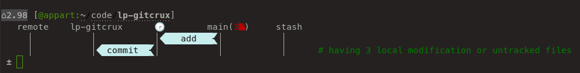
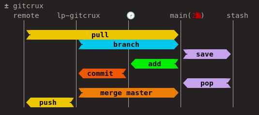

GitCrux — A Liquid Prompt Theme
===============================

GitCrux is a theme for [Liquid Prompt](https://github.com/nojhan/liquidprompt),
showing visual hints inspired from [GitCrux](https://github.com/nojhan/gitcrux).

The objective of GitCrux is to help you finding which Git command to use,
given the current state of your Git repository.
Hints are given in a visual way, helping the user to understand what commands
will change.

It targets users who are starting out with Git and struggle to rembemer
the classical Git workflow.

Example:



Design
------

The first line of the prompt is the classical theme right from Liquid Prompt,
only without the VCS information.

The second line shows the five main states tracked by Git:

- the remote repository (with the number of remote commits behind),
- the local repository (showed by its name),
- the staged changes (showing either a wall clock, or the number of altered lines),
- the branch (and the number of commits ahead),
- the stash.

All lines after show colored arrow, figuring what states the denoted command
will change. The color of the arrow figures the urgency to issue that command.

For instance, if there is only a few lines changed, the "add" arrow is shown
in a light color, if there is several modified lines, the arrow will be colored
more strongly, and if there is too much editions, the arrow will be heavily
colored.

The prompt comes with the `gitcrux` command, that displays a diagram showing
all the supported commands:




Setup
-----

To actually use the GitCrux theme, you need to add a few configuration commands
to the script that loads Liquid Prompt. For example:

```sh
# Load Liquid Prompt.
source ~/liquidprompt/liquidprompt
# Load the theme.
source ~/lp-gitcrux/gitcrux.theme && lp_theme gitcrux
```

By default, GitCrux needs a [Nerd-font](https://www.nerdfonts.com/) to display
the arrows correctly.
See the [Nerd-fonts Fonts installation docs](https://www.nerdfonts.com/)
for help on installing this kind of fonts.
If you do not have a Nerd-font, you may configure
`GITCRUX_ARROW_RIGHT` and `GITCRUX_ARROW_RIGHT` to draw different arrow styles
(see below).


Configuration
-------------

### Liquid Prompt Configuration

The GitCrux theme honors all Liquid Prompt configuration options.

However, the command hints only targets Git (so far), even if they are showed
for any supported VCS repository.


### Theme configuration

#### Arrows

**GITCRUX_ARROW_RIGHT** *array* = ( "" "" )

Symbols used to draw arrow heads and tails.

**GITCRUX_ARROW_LEFT** *array* = ( "" "" )

Symbols used to draw arrow heads and tails.

**GITCRUX_MIN_COL_WIDTH** *integer* = 8

Minimum width of each of the Git state columns.

**GITCRUX_COL_DYNAMIC** *boolean* = 1

Automatically increase each columns width if at least one of the column text
is larger than `GITCRUX_MIN_COL_WIDTH`.

**GITCRUX_SHOW_EXPLANATION** *boolean* = 1

Show a sentence explaining why the hint is shown.


#### Colors

**GITCRUX_COLOR_WEAK** *string* = "0 195 0"

Color of arrows if the related sensor is below "normal".

**GITCRUX_COLOR_NORMAL** *string* = "0 39 1"

Color of arrows if the related sensor is above "normal" and below "strong".

**GITCRUX_COLOR_STRONG** *string* = "0 220 1"

Color of arrows if the related sensor is above "strong".

**GITCRUX_COLOR_MSG** *string* = "0 244 0"

Color of error messages.

**GITCRUX_COLOR_EXPLANATION** *string* = "28 -1 0"

Color of explanation messages.


#### Thresholds.

**GITCRUX_THRESH_BEHIND_NORMAL** *integer* = 2

How many commits behind remote needs a "normal" alert.

**GITCRUX_THRESH_BEHIND_STRONG** *integer* = 5

How many commits behind remote needs a "strong" alert.


**GITCRUX_THRESH_AHEAD_NORMAL** *integer* = 2

How many commits ahead of remote needs a "normal" alert.

**GITCRUX_THRESH_AHEAD_STRONG** *integer* = 5

How many commits ahead remote needs a "strong" alert.


**GITCRUX_THRESH_LINES_NORMAL** *integer* = 100

How many modified lines needs a "normal" alert.

**GITCRUX_THRESH_LINES_STRONG** *integer* = 500

How many modified lines needs a "strong" alert.


**GITCRUX_THRESH_ADD_NORMAL** *integer* = 100

How many added files needs a "normal" alert.

**GITCRUX_THRESH_ADD_STRONG** *integer* = 500

How many added files needs a "strong" alert.


**GITCRUX_THRESH_STASH_NORMAL** *integer* = 1

How many stashed commits needs a "normal" alert.

**GITCRUX_THRESH_STASH_STRONG** *integer* = 5

How many stashed commits needs a "strong" alert.


